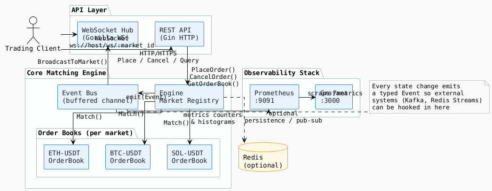
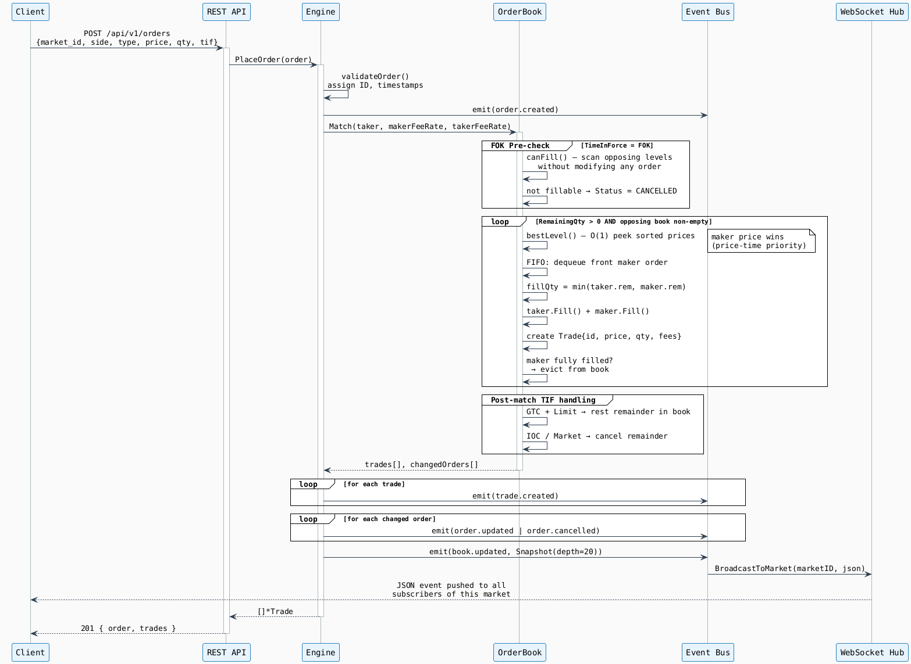
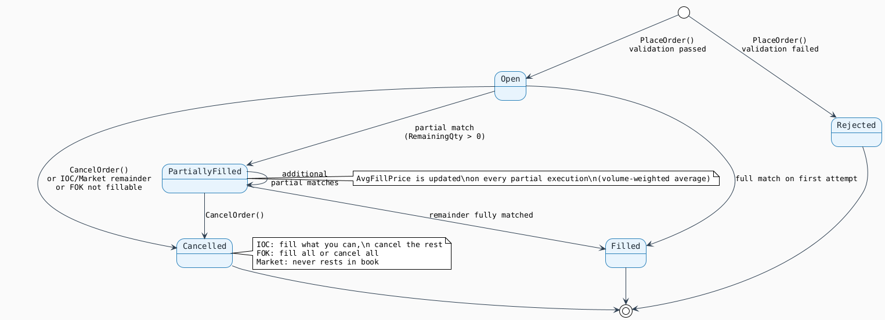
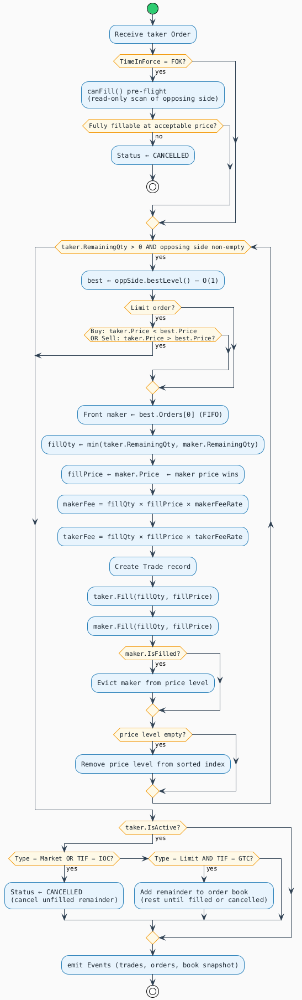
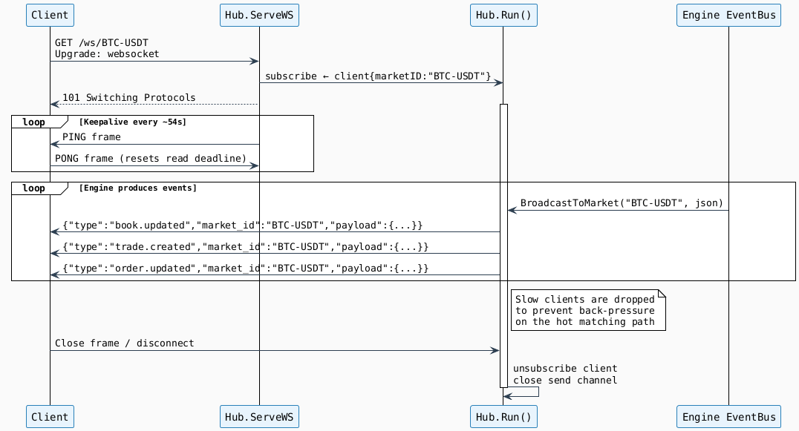
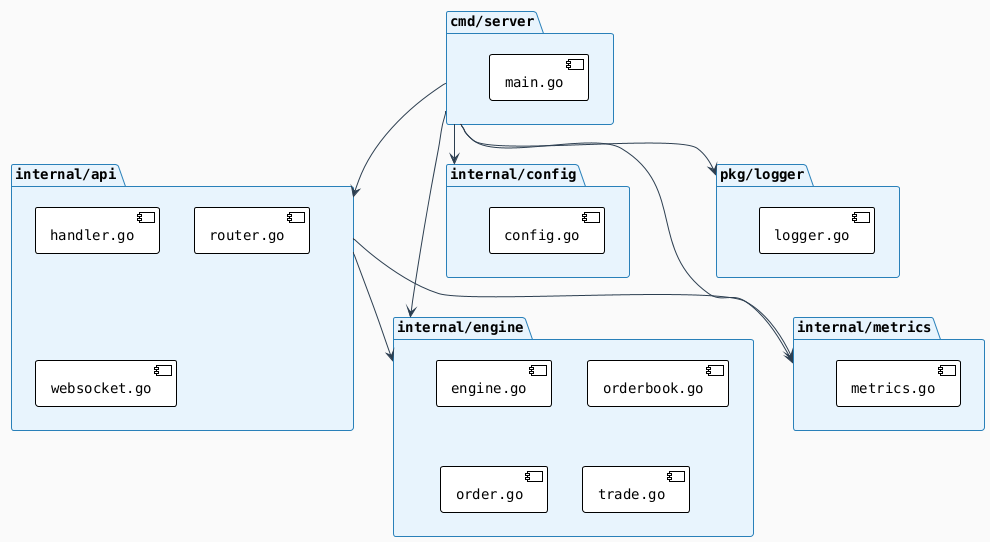

# Matching Engine

A production-grade **crypto trading matching engine** written in Go.
Implements price-time priority (FIFO) matching with real-time WebSocket streaming,
Prometheus metrics, and a clean event bus for external integration.

---

## Architecture

### System Overview



---

### Order Matching — Sequence Flow



---

### Order Lifecycle — State Diagram



---

### Matching Algorithm — Flow Diagram



---

### WebSocket — Connection & Event Flow



---

### Package Dependency Graph



---

## Features

| Feature | Detail |
|---|---|
| **Matching algorithm** | Price-Time Priority (FIFO) — industry standard |
| **Order types** | `limit`, `market`, `stop_limit` |
| **Time-in-Force** | `gtc` (Good Till Cancel), `ioc` (Immediate or Cancel), `fok` (Fill or Kill) |
| **Fee model** | Asymmetric maker/taker fees per market, calculated per trade |
| **Avg fill price** | Volume-weighted average maintained on every partial fill |
| **Real-time feed** | WebSocket per market — book updates, trades, order changes |
| **REST API** | Full order lifecycle + market data + health probes |
| **Observability** | Prometheus metrics + Grafana dashboard-ready |
| **Integration** | Typed event bus — hook into Kafka / Redis Streams with one function |
| **Graceful shutdown** | Drains in-flight requests before exit |
| **Containerised** | Multi-stage Docker build + full Docker Compose stack |
| **Precision math** | `shopspring/decimal` — no floating-point errors on prices/quantities |

---

## Quick Start

### Docker Compose (recommended)

```bash
# Clone and start the full stack
# (Engine + Redis + Prometheus + Grafana)
git clone <repo>
cd matching-engine
docker-compose up -d

# Check engine health
curl http://localhost:8080/health

# View logs
docker-compose logs -f matching-engine
```

| Service | URL |
|---|---|
| REST API | `http://localhost:8080` |
| Prometheus | `http://localhost:9091` |
| Grafana | `http://localhost:3000` (admin / admin) |
| Redis | `localhost:6379` |

### Local Development

```bash
# Copy env template and adjust values
cp .env.example .env

# Download dependencies
go mod download

# Run the server
make run

# Or directly:
go run ./cmd/server/
```

---

## Project Structure

```
matching-engine/
├── cmd/
│   └── server/
│       └── main.go            # Entry point — wires all components
│
├── internal/
│   ├── engine/
│   │   ├── engine.go          # Market registry, PlaceOrder, CancelOrder, event bus
│   │   ├── orderbook.go       # Price-time priority book (sorted levels + FIFO queues)
│   │   ├── order.go           # Order model, side/type/TIF/status types, Fill()
│   │   └── trade.go           # Trade model (maker + taker IDs, price, qty, fees)
│   │
│   ├── api/
│   │   ├── handler.go         # HTTP handlers (orders, markets, health)
│   │   ├── router.go          # Gin router + middleware (CORS, request-ID, logger)
│   │   └── websocket.go       # WebSocket hub — per-market broadcast, ping/pong
│   │
│   ├── config/
│   │   └── config.go          # Viper config loader (ME_* env vars)
│   │
│   └── metrics/
│       └── metrics.go         # Prometheus counters, histograms, gauges
│
├── pkg/
│   └── logger/
│       └── logger.go          # zap logger factory (JSON prod / colour dev)
│
├── Dockerfile                 # 2-stage build: golang:1.21-alpine → alpine:3.19
├── docker-compose.yml         # Engine + Redis + Prometheus + Grafana
├── prometheus.yml             # Scrape config
├── Makefile                   # Build / run / test / lint targets
├── .env.example               # All ME_* environment variables with defaults
├── go.mod
└── go.sum
```

---

## REST API Reference

All responses use the envelope:

```json
{ "data": <payload>,  "error": null }
{ "data": null,       "error": "message" }
```

### Health

#### `GET /health`
Liveness probe — always returns 200 while the process is alive.

```bash
curl http://localhost:8080/health
```
```json
{ "data": { "status": "ok", "timestamp": "2024-01-01T00:00:00Z" }, "error": null }
```

#### `GET /ready`
Readiness probe — returns 503 until at least one market is registered.

---

### Markets

#### `GET /api/v1/markets` — List all markets

```bash
curl http://localhost:8080/api/v1/markets
```
```json
{
  "data": [
    {
      "id": "BTC-USDT",
      "base_currency": "BTC",
      "quote_currency": "USDT",
      "maker_fee_rate": "0.001",
      "taker_fee_rate": "0.002",
      "min_order_size": "0.0001",
      "max_order_size": "100",
      "is_active": true
    }
  ],
  "error": null
}
```

#### `GET /api/v1/markets/:market_id` — Get market

```bash
curl http://localhost:8080/api/v1/markets/BTC-USDT
```

#### `GET /api/v1/markets/:market_id/orderbook?depth=20` — Order book snapshot

```bash
curl "http://localhost:8080/api/v1/markets/BTC-USDT/orderbook?depth=5"
```
```json
{
  "data": {
    "market_id": "BTC-USDT",
    "bids": [
      { "price": "50000.00", "quantity": "1.500", "count": 3 },
      { "price": "49990.00", "quantity": "0.800", "count": 1 }
    ],
    "asks": [
      { "price": "50001.00", "quantity": "0.500", "count": 1 },
      { "price": "50005.00", "quantity": "2.000", "count": 4 }
    ],
    "timestamp": "2024-01-01T00:00:00Z"
  },
  "error": null
}
```

#### `GET /api/v1/markets/:market_id/ticker` — Best bid/ask + spread

```bash
curl http://localhost:8080/api/v1/markets/BTC-USDT/ticker
```

#### `GET /api/v1/markets/:market_id/trades` — Recent trades (placeholder)

---

### Orders

#### `POST /api/v1/orders` — Place an order

**Limit GTC (rests in book)**
```bash
curl -X POST http://localhost:8080/api/v1/orders \
  -H "Content-Type: application/json" \
  -d '{
    "market_id":    "BTC-USDT",
    "user_id":      "user-abc",
    "side":         "buy",
    "type":         "limit",
    "time_in_force":"gtc",
    "price":        "50000.00",
    "quantity":     "0.5"
  }'
```

**Market order (fill immediately)**
```bash
curl -X POST http://localhost:8080/api/v1/orders \
  -H "Content-Type: application/json" \
  -d '{
    "market_id": "BTC-USDT",
    "user_id":   "user-abc",
    "side":      "sell",
    "type":      "market",
    "quantity":  "0.1"
  }'
```

**Fill or Kill**
```bash
curl -X POST http://localhost:8080/api/v1/orders \
  -H "Content-Type: application/json" \
  -d '{
    "market_id":    "ETH-USDT",
    "user_id":      "user-xyz",
    "side":         "buy",
    "type":         "limit",
    "time_in_force":"fok",
    "price":        "3000.00",
    "quantity":     "10"
  }'
```

Response:
```json
{
  "data": {
    "order": {
      "id":            "550e8400-e29b-41d4-a716-446655440000",
      "market_id":     "BTC-USDT",
      "user_id":       "user-abc",
      "side":          "buy",
      "type":          "limit",
      "time_in_force": "gtc",
      "price":         "50000",
      "quantity":      "0.5",
      "filled_qty":    "0.5",
      "remaining_qty": "0",
      "avg_fill_price":"50000",
      "status":        "filled",
      "created_at":    "2024-01-01T00:00:00Z",
      "updated_at":    "2024-01-01T00:00:00Z"
    },
    "trades": [
      {
        "id":            "trade-uuid",
        "market_id":     "BTC-USDT",
        "maker_order_id":"maker-uuid",
        "taker_order_id":"550e8400-...",
        "side":          "buy",
        "price":         "50000",
        "quantity":      "0.5",
        "maker_fee":     "0.025",
        "taker_fee":     "0.05",
        "created_at":    "2024-01-01T00:00:00Z"
      }
    ]
  },
  "error": null
}
```

#### `GET /api/v1/orders/:market_id/:order_id` — Get a resting order

```bash
curl http://localhost:8080/api/v1/orders/BTC-USDT/550e8400-e29b-41d4-a716-446655440000
```

#### `DELETE /api/v1/orders/:market_id/:order_id` — Cancel an order

```bash
curl -X DELETE http://localhost:8080/api/v1/orders/BTC-USDT/550e8400-e29b-41d4-a716-446655440000
```

---

### Metrics

#### `GET /metrics` — Prometheus scrape endpoint

Key metrics exposed:

| Metric | Type | Labels |
|---|---|---|
| `matching_engine_orders_total` | Counter | market, side, type, status |
| `matching_engine_trades_total` | Counter | market, side |
| `matching_engine_trade_volume_quote_total` | Counter | market |
| `matching_engine_matching_latency_seconds` | Histogram | market |
| `matching_engine_orderbook_depth_levels` | Gauge | market, side |
| `matching_engine_orders_in_book` | Gauge | market |
| `matching_engine_websocket_connections_active` | Gauge | — |

---

## WebSocket Documentation

### Connect

```
ws://localhost:8080/ws/:market_id
```

Example: `ws://localhost:8080/ws/BTC-USDT`

Every event emitted by the engine for this market is pushed in real-time as a JSON object.

### Event Message Format

```json
{
  "type":      "<event_type>",
  "market_id": "BTC-USDT",
  "payload":   { ... },
  "timestamp": "2024-01-01T00:00:00Z"
}
```

| `type` | Trigger | Payload type |
|---|---|---|
| `order.created` | Every new order submitted | `Order` |
| `order.updated` | After any fill | `Order` |
| `order.cancelled` | Cancel or IOC/FOK/Market remainder | `Order` |
| `trade.created` | Every matched trade | `Trade` |
| `book.updated` | After every order event | `OrderBookSnapshot` |

### book.updated payload example

```json
{
  "type":      "book.updated",
  "market_id": "BTC-USDT",
  "payload": {
    "market_id": "BTC-USDT",
    "bids": [{ "price": "50000", "quantity": "1.5", "count": 2 }],
    "asks": [{ "price": "50001", "quantity": "0.5", "count": 1 }],
    "timestamp": "2024-01-01T00:00:00Z"
  }
}
```

### JavaScript Example

```javascript
const ws = new WebSocket("ws://localhost:8080/ws/BTC-USDT");

ws.onopen = () => console.log("Connected to BTC-USDT feed");

ws.onmessage = ({ data }) => {
  const event = JSON.parse(data);

  switch (event.type) {
    case "book.updated":
      renderOrderBook(event.payload.bids, event.payload.asks);
      break;
    case "trade.created":
      appendTradeRow(event.payload);
      break;
    case "order.updated":
    case "order.cancelled":
      updateOrderStatus(event.payload);
      break;
  }
};

ws.onclose = () => setTimeout(() => reconnect(), 1000); // auto-reconnect
```

---

## Integration Guide

The engine exposes a **typed event bus** (`engine.Events() <-chan *Event`).
The fan-out goroutine in `cmd/server/main.go` (`fanOutEvents`) is the single
integration point. To connect to any external message broker:

1. Open `cmd/server/main.go`
2. Find the `fanOutEvents` function
3. Add your publisher alongside the existing WebSocket broadcast

### Event Types

```go
const (
    EventOrderCreated   EventType = "order.created"
    EventOrderUpdated   EventType = "order.updated"
    EventOrderCancelled EventType = "order.cancelled"
    EventTradeCreated   EventType = "trade.created"
    EventBookUpdated    EventType = "book.updated"
)
```

Each `Event.Payload` is a fully typed Go value:
- `*engine.Order` for order events
- `*engine.Trade` for trade events
- `*engine.OrderBookSnapshot` for book events

### Kafka Integration (example)

```go
// In fanOutEvents, after the WebSocket broadcast:
case engine.EventTradeCreated:
    if trade, ok := evt.Payload.(*engine.Trade); ok {
        msg, _ := json.Marshal(trade)
        kafkaProducer.Produce(&kafka.Message{
            TopicPartition: kafka.TopicPartition{
                Topic:     &evt.MarketID,
                Partition: kafka.PartitionAny,
            },
            Key:   []byte(trade.ID),
            Value: msg,
        }, nil)
    }
```

### Redis Pub/Sub Integration (example)

```go
case engine.EventBookUpdated:
    rdb.Publish(ctx, "book:"+evt.MarketID, data)
```

---

## Configuration Reference

All configuration is via environment variables prefixed with `ME_`.

| Variable | Default | Description |
|---|---|---|
| `ME_SERVER_PORT` | `8080` | HTTP server port |
| `ME_SERVER_READTIMEOUT` | `30s` | HTTP read timeout |
| `ME_SERVER_WRITETIMEOUT` | `30s` | HTTP write timeout |
| `ME_SERVER_SHUTDOWNTIMEOUT` | `10s` | Graceful shutdown deadline |
| `ME_ENGINE_EVENTBUFFERSIZE` | `10000` | Event channel buffer capacity |
| `ME_REDIS_ADDR` | `localhost:6379` | Redis address |
| `ME_REDIS_PASSWORD` | `` | Redis password |
| `ME_REDIS_DB` | `0` | Redis database index |
| `ME_REDIS_ENABLED` | `false` | Enable Redis integration |
| `ME_LOG_LEVEL` | `info` | Log level: `debug`, `info`, `warn`, `error` |
| `ME_LOG_JSON` | `false` | JSON log output (enable in production) |

Default markets loaded at startup: **BTC-USDT**, **ETH-USDT**, **SOL-USDT** — all with 0.1% maker / 0.2% taker fees.

---

## Development Setup

### Prerequisites

- Go 1.21+
- Docker + Docker Compose (for the full stack)
- `golangci-lint` (for linting)

### Make Targets

```bash
make build        # Compile to ./server
make run          # go run ./cmd/server/
make test         # go test ./...
make test-cover   # run tests with coverage report
make lint         # golangci-lint run
make tidy         # go mod tidy
make docker-build # docker build -t matching-engine .
make docker-up    # docker-compose up -d
make docker-down  # docker-compose down
make clean        # remove build artifacts
make help         # list all targets
```

### Running Tests

```bash
go test ./...
go test -race ./...                          # with race detector
go test -v ./internal/engine/...            # engine tests only
go test -run TestOrderBook_Match ./...      # specific test
```

---

## Performance Notes

- **Mutex scope**: each `OrderBook` has its own `sync.RWMutex`, so different markets match concurrently without contention.
- **Price level lookup**: `O(1)` via `map[string]*PriceLevel` keyed by `price.String()`.
- **Price ordering**: sorted `[]decimal.Decimal` slice maintained via binary search insert — `O(log n)` inserts, `O(1)` best-price reads.
- **Event bus**: non-blocking `select` — a slow consumer never stalls the matching hot path; events are dropped with a warning log.
- **WebSocket batching**: queued messages are batched into a single WebSocket frame per write-pump cycle to reduce syscall overhead.

---

## License

MIT
